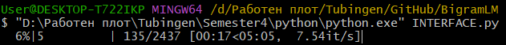
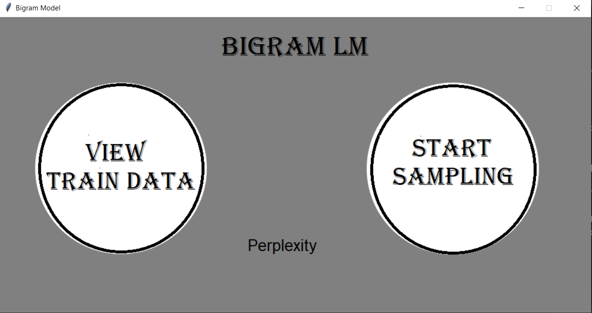
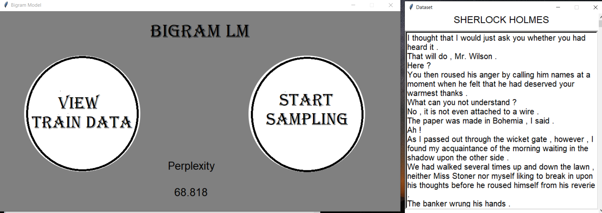
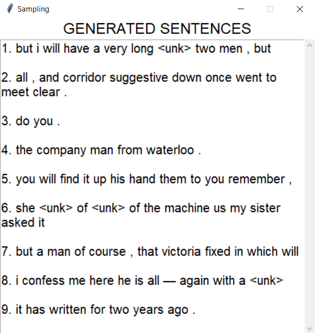

<h1 align="center"> Kneyser-Ney Bigram Language Model </h1>

Built by exact description as in ***https://web.stanford.edu/~jurafsky/slp3/***.

<h2>The Model</h2>

Implementation of N-gram language model that looks one word into the past, also called Bigram. The idea of the model is
to predict the next word, given it's predictions so far.
OOV words have special token and <em>Kneyser-Ney</em> smoothing technique is applied to avoid zero counts/increase
probabilities of rare events. The text generation technique implemented is weighted **random sampling**.  

<h2>Usage</h2>

1. Clone the repository, open terminal in the cloned folder and type `python INTERFACE.py`. You will see a progress bar,
   indicating how the training is going.

2. When it is ready, the welcome screen will appear.

3. You can view the training data and/or the perplexity on the test data, which is available
   in `data/SherlockHolmes-test.txt`. The lower the perplexity, the less surprised is the model of the new sentences. Just click on "Perplexity".

4. You can sample from the model, generate a random number (1-20) of sentences that the model thinks are likely.
   Depending on the frequency threshold during training <em>(3)</em>, some words could be the **unknown** token.

